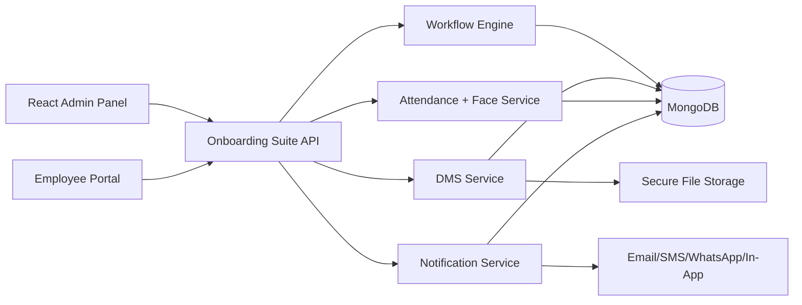

# Onboarding Suite Folder Structure

## Backend

```txt
server/modules/onboarding-suite/
  index.js
  routes.js
  controller.js
  models.js
  workflow-engine.service.js
  dms.service.js
  attendance-face.service.js
  notification.service.js
  security.js
  storage.js
```

## Frontend

```txt
client/src/modules/onboarding-suite/
  index.js
  api.js
  OnboardingSuiteAdmin.jsx
  OnboardingSuitePortal.jsx
  onboardingSuite.css
```

## Suggested React Route Mounts

```jsx
import { OnboardingSuiteAdmin, OnboardingSuitePortal } from '../modules/onboarding-suite';

<Route path="/hr/onboarding-suite" element={<OnboardingSuiteAdmin />} />
<Route path="/employee/onboarding-suite/:assignmentId" element={<OnboardingSuitePortal />} />
```

For the employee route, pass `assignmentId` from `useParams()`:

```jsx
function EmployeeOnboardingSuiteRoute() {
  const { assignmentId } = useParams();
  return <OnboardingSuitePortal assignmentId={assignmentId} />;
}
```

## Architecture



## Production Notes

- Mount behind existing JWT auth and RBAC.
- Keep all queries tenant-scoped.
- Store files outside MongoDB.
- Use `ONBOARDING_FACE_ENCRYPTION_KEY` in production.
- Use Redis/BullMQ for notification retries and delayed reminders if you need distributed workers.
- Use the existing face-api frontend to generate real descriptors instead of the demo descriptor in `FaceStep`.
- Use template versioning: do not edit active assignments when templates change.
- Add CDN/signed URLs for document download in production.
- Add antivirus scanning before document approval.
- Add WebSocket rooms for realtime HR dashboard updates.

## Clean Architecture Boundaries

Workflow engine:

- template resolution
- condition evaluation
- dependency unlock
- state transitions
- approval chains

DMS:

- secure upload
- categorization
- immutable versions
- document review

Attendance/Face:

- descriptor encryption
- liveness/GPS validation
- face approval
- attendance locking
- punch validation

Notification:

- event publishing
- delivery tracking
- provider adapters
- realtime emission

