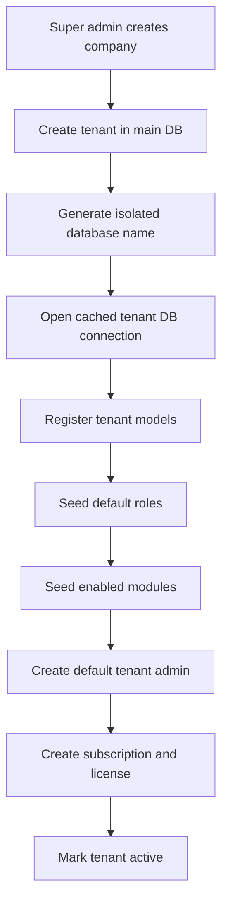
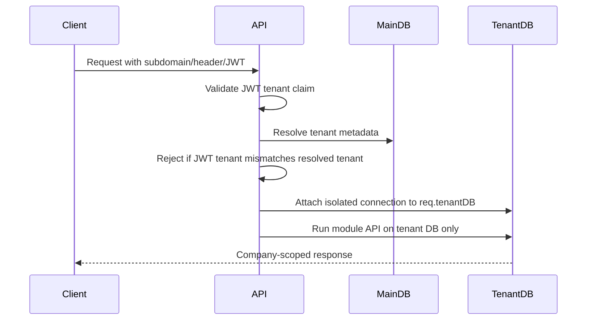

# Enterprise Multi-Tenant SaaS HRMS Architecture

## Folder Structure

```text
server/
  core/                  # main-database models, controllers, services
  tenant/                # tenant database models and module APIs
  middleware/            # tenant resolution, JWT validation, RBAC
  modules/               # domain modules can plug into req.tenantDB
  shared/                # constants, errors, reusable utilities
  database/              # connection manager and tenant DB cache
  routes/enterprise.routes.js
```

## Main Database

The main database stores SaaS control-plane data only:

- `tenants`
- `subscriptions`
- `plans`
- `modules`
- `licenses`
- `audit_logs`
- `system_admins`

Every company gets a separate MongoDB database named from its tenant slug and object id. Tenant data such as employees, attendance, payroll, recruitment, onboarding, leaves, documents, assets, workflows, social media, and DMS lives only in that company database.

## Lifecycle Flow



## Request Isolation Flow



## Security Model

- JWT contains `tenantId`, `tenantSlug`, `databaseName`, `roleCode`, and `scope`.
- Tenant middleware resolves tenant from `x-tenant-id`, `x-tenant-slug`, subdomain, domain, or token.
- If token tenant and resolved tenant differ, the request is rejected.
- RBAC loads the user and role from `req.tenantDB`, so permissions cannot bleed across companies.
- Audit logs are written to the main DB for SaaS actions and tenant DB for company actions.
- Passwords are hashed with bcrypt.
- Rate limiting, Helmet, CORS, and sanitization remain handled by the existing app middleware.

## API Surface

```text
POST /api/enterprise/bootstrap/system-admin
POST /api/enterprise/system/login
POST /api/enterprise/tenants
GET  /api/enterprise/tenants
GET  /api/enterprise/connections
POST /api/enterprise/tenant/login

GET    /api/enterprise/tenant/:moduleKey
POST   /api/enterprise/tenant/:moduleKey
GET    /api/enterprise/tenant/:moduleKey/:id
PUT    /api/enterprise/tenant/:moduleKey/:id
DELETE /api/enterprise/tenant/:moduleKey/:id
```

Supported `moduleKey` values:

`employees`, `attendance`, `payroll`, `recruitment`, `onboarding`, `leaves`, `documents`, `assets`, `workflows`, `social_media`, `dms`.

## Production Notes

- Use a strong `JWT_SECRET` and rotate secrets through a managed secrets store.
- Use TLS-only MongoDB connections and database users with least privilege.
- Set `TENANT_DB_CACHE_SIZE` based on memory and active tenant count.
- Add MongoDB Atlas backup policies per cluster and PITR where available.
- Keep `autoIndex=false` in production and run index migrations deliberately.
- Add WAF or API gateway tenant domain validation before Express.
- Use background jobs for heavy provisioning if tenant setup grows beyond a few seconds.
